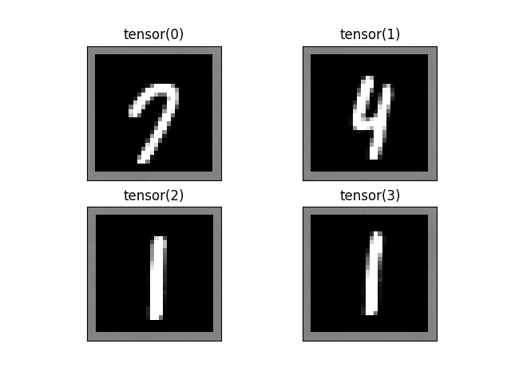
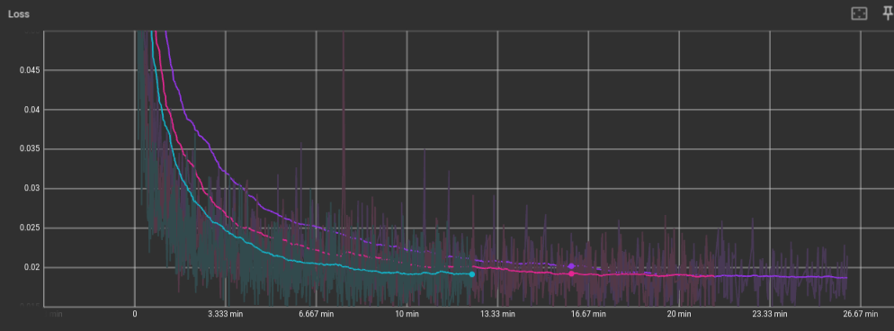

# DDPM (Denoising Diffusion Probabilistic Model)
This is an implementation of the DDPM algorithm for generating images.

[The original paper](https://arxiv-org.translate.goog/abs/2006.11239?_x_tr_sl=en&_x_tr_tl=it&_x_tr_hl=it&_x_tr_pto=sc)

## Datasets
- MNIST [1x28x28]

## Network Implemented
- Simple U-Net 
- U-Net + time embedding
- U-Net + time embedding + WideResNet

## Results

### Training

